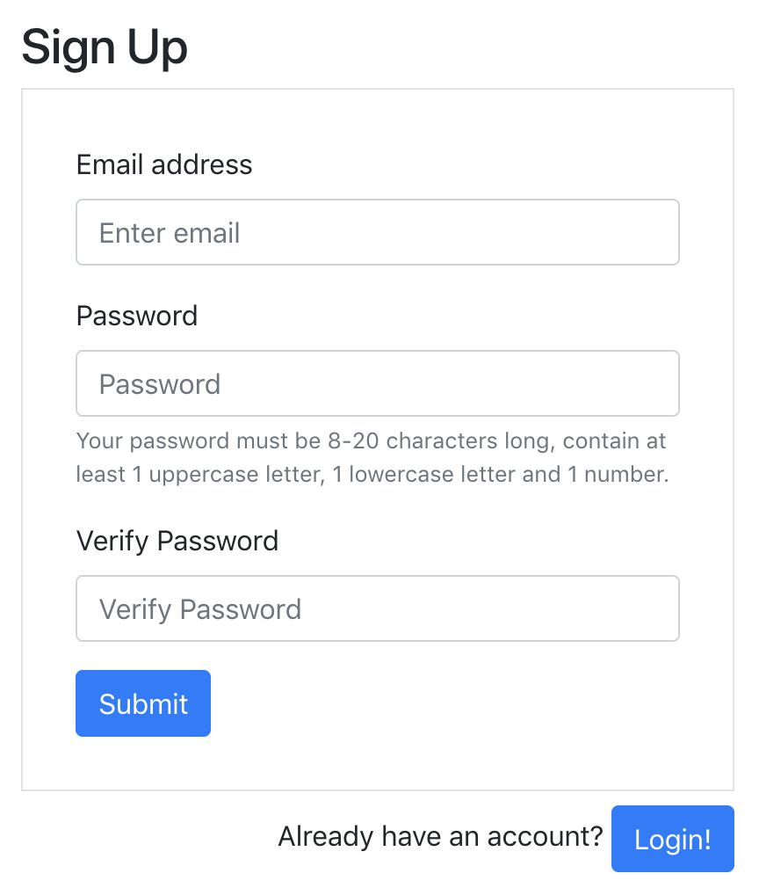

This repo was created to be an email authentication included starter kit with firebase. Includes a signup and login page.

Steps to use:

1. Fork and clone repository.
2. npm install
3. Create a project on firebase (https://console.firebase.google.com/)
4. Create a .env file
5. Populate the .env file with the following, replacing the X's with code the config code from firebase:

  REACT_APP_API_KEY = XXXXXXXXXXXXXXXXXXX
  REACT_APP_AUTH_DOMAIN = XXXXXXXXXXXXXXXXXXX
  REACT_APP_DATABASE_URL = XXXXXXXXXXXXXXXXXXX
  REACT_APP_PROJECT_ID = XXXXXXXXXXXXXXXXXXX
  REACT_APP_STORAGE_BUCKET = XXXXXXXXXXXXXXXXXXX
  REACT_APP_MESSAGING_SENDER_ID = XXXXXXXXXXXXXXXXXXX

6. npm start
